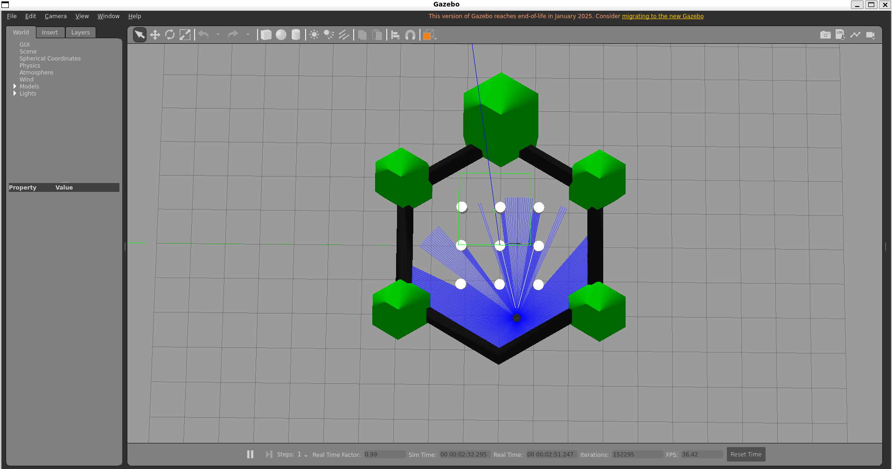
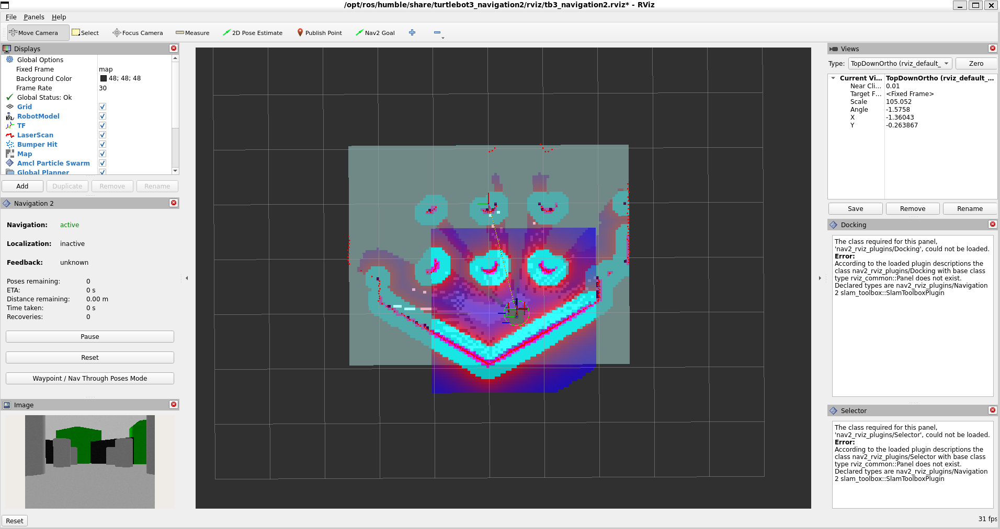

# **🤖 Embodied AI Autonomous Mobile Robot (AMR) Assistant**

An end-to-end Embodied AI system operating in **ROS 2 Humble** and **Gazebo 11**. The system combines local LLM cognitive reasoning (**Ollama**), real-time 2D SLAM mapping and path planning (**Nav2** + **SLAM Toolbox**), and real-time deep learning computer vision (**YOLOv8** with direct NumPy buffer parsing).

Designed to run completely **offline with zero cloud dependencies** inside Ubuntu 22.04 LTS / WSL2.

## **📋 Table of Contents**

1. [System Architecture \& Data Flow](#bookmark=id.8m1ex2kpb5kz)
2. [Project \& File Structure](#bookmark=id.k2kf7agt5ct6)
3. [Prerequisites](#bookmark=id.6ycabtf4oz77)
4. [First-Time System Installation](#bookmark=id.mntrsew853rm)
5. [Workspace Setup \& Build](#bookmark=id.9f3cto8nb7f3)
6. [Step-by-Step Terminal Execution Guide](#bookmark=id.if7dvktg0oto)
7. [Core Nodes Overview](#bookmark=id.j0rfk6vosh9m)
8. [Comprehensive Troubleshooting Guide](#bookmark=id.ga2uyvqqk1pb)
9. [Customization \& Future Extensions](#bookmark=id.rkm9up23ppak)

## **1. System Architecture \& Data Flow**

&#x20;                              \\+------------------------+  
|   User Voice / Text    |  
\\+-----------+------------+  
|  
v  
\\+------------------------+  
|  AI Brain Node (LLM)   |  
|  (Ollama Local API)    |  
\\+----+--------------+----+  
|              ^  
Goal Pose (Geometry)       |              | Detected Objects  
v              |

+-------------------------------------+          +-+-------------------------------+  
|      Nav2 + SLAM Toolbox            |          |    YOLOv8 Object Detector Node  |  
|  (Path Planning \& Localization)     |          |      (Custom NumPy Pipeline)    |  
+----------------+--------------------+          +----------------+----------------+  
|                                                ^  
| /cmd\_vel                                       | /camera/image\_raw  
v                                                |  
+-----------------------------------------------------------------+----------------+  
|                         Gazebo Simulation Environment                            |  
|                           (TurtleBot3 Waffle Pi)                                 |  
+----------------------------------------------------------------------------------+

### **Subsystem Breakdown:**

1. **Cognitive Layer (ai\_brain.py)**: Connects to local Ollama REST API (http://localhost:11434), extracts intent from natural language commands into JSON, and issues goal poses via the NavigateToPose action client.
2. **Navigation \& Mapping Layer (Nav2 + slam\_toolbox)**: Builds a 2D occupancy grid map from 360° LIDAR data (/scan), computes global/local costmaps, tracks TF transforms (map -> odom -> base\_footprint), and plans collision-free motion paths.
3. **Perception Layer (object\_detector.py)**: Subscribes to raw camera feeds (/camera/image\_raw), decodes binary byte buffers directly using zero-copy NumPy matrix transformations, executes YOLOv8 neural network inference, and publishes spatial detections and annotated frames (/camera/image\_yolo).
4. **Simulation Layer (Gazebo 11)**: Simulates ODE rigid-body physics, differential drive wheel kinematics, 360° LIDAR ray casting, and RGB camera sensors.

## **2. Project \& File Structure**

Your ROS 2 package resides inside the src directory of your workspace (\~/embodied\_bot\_ws):

embodied\_bot\_ws/  
└── src/  
└── embodied\_assistant/  
├── config/                  # Configuration YAML files (Nav2, Costmaps)  
├── embodied\_assistant/      # Python source module directory  
│   ├── \_\_init\_\_.py  
│   ├── ai\_brain.py          # Local LLM integration \& Nav2 Goal Action Client  
│   └── object\_detector.py   # YOLOv8 Computer Vision Node (Direct Buffer)  
├── resource/                # Package index marker  
├── test/                    # Unit testing scripts (pytest / ament\_flake8)  
├── .env.example             # Template environment variables  
├── package.xml              # ROS 2 package metadata \& system dependencies  
├── README.md                # This documentation file  
├── requirements.txt         # Python package requirements (NumPy < 2 lock)  
├── setup.cfg                # Package installation configuration  
└── setup.py                 # Setuptools script with console\_scripts entry points

## **3. Prerequisites**

* **Operating System**: Ubuntu 22.04 LTS or Windows Subsystem for Linux 2 (**WSL2 Ubuntu 22.04** with WSLg enabled).
* **ROS 2 Distribution**: ROS 2 Humble Hawksbill (Desktop Install).
* **Python Engine**: Python 3.10+.
* **Local LLM Runner**: Ollama (llama3 or qwen2 model pulled).
* **Simulated Hardware**: TurtleBot3 Waffle Pi (export TURTLEBOT3\_MODEL=waffle\_pi).

## **4. First-Time System Installation**

Follow these steps sequentially on a fresh Ubuntu 22.04 or WSL2 installation.

### **Step 4.1: Update System \& Install Core Build Tools**

Open terminal (**Ctrl + Alt + T**):

sudo apt update \&\& sudo apt upgrade -y  
sudo apt install -y git python3-pip python3-rosdep python3-colcon-common-extensions curl

### **Step 4.2: Install ROS 2 Humble**

If ROS 2 Humble is not yet installed:

sudo apt install -y software-properties-common  
sudo add-apt-repository universe -y  
sudo apt update \&\& sudo apt install -y curl

sudo curl -sSL https://raw.githubusercontent.com/ros/rosdistro/master/ros.key -o /usr/share/keyrings/ros-archive-keyring.gpg  
echo "deb \[arch=$(dpkg --print-architecture) signed-by=/usr/share/keyrings/ros-archive-keyring.gpg] http://packages.ros.org/ros2/ubuntu $(. /etc/os-release \&\& echo $UBUNTU\_CODENAME) main" | sudo tee /etc/apt/sources.list.d/ros2.list > /dev/null

sudo apt update  
sudo apt install -y ros-humble-desktop ros-humble-gazebo-ros-pkgs ros-humble-turtlebot3\* ros-humble-navigation2 ros-humble-nav2-bringup ros-humble-slam-toolbox

Initialize rosdep:

sudo rosdep init  
rosdep update

### **Step 4.3: Install \& Start Ollama Local LLM Engine**

In a new terminal window:

\# Install Ollama  
curl -fsSL https://ollama.com/install.sh | sh

\# Start Ollama service in background and pull Llama 3 model  
ollama serve \&  
ollama pull llama3

## **5. Workspace Setup \& Build**

### **Step 5.1: Create Workspace \& Clone Repository**

mkdir -p \~/embodied\_bot\_ws/src  
cd \~/embodied\_bot\_ws/src

\# Clone this repository into src/  
git clone https://github.com/YOUR-GITHUB-USERNAME/embodied\_assistant.git

### **Step 5.2: Install Python Dependencies (Crucial NumPy 1.x Lock)**

> ⚠️ \\\*\\\*CRITICAL:\\\*\\\* ROS 2 Humble C-API binary wrappers require numpy \\\\< 2.0. Installing standard ultralytics will upgrade NumPy to 2.x and break ROS 2\\\\. Run this exact command to freeze versions correctly:

pip3 install "numpy<2" "matplotlib<3.9" ultralytics requests

### **Step 5.3: Resolve ROS Dependencies \& Build**

cd \~/embodied\_bot\_ws

\# Install system dependencies declared in package.xml  
rosdep install --from-paths src --ignore-src -y

\# Build the workspace  
colcon build --symlink-install

\# Source workspace  
source install/setup.bash

## **6. Step-by-Step Terminal Execution Guide**

To avoid hardware acceleration conflicts, display crashes, or ROS 2 discovery race conditions, start the system using **4 separate terminal windows** in exact sequence.

### **🖥️ Terminal 1: Launch Gazebo Simulation World**

source /opt/ros/humble/setup.bash  
export TURTLEBOT3\_MODEL=waffle\_pi  
export GAZEBO\_MODEL\_DATABASE\_URI=""  
export QT\_X11\_NO\_MITSHM=1  
export MESA\_GL\_VERSION\_OVERRIDE=3.3  
export LIBGL\_ALWAYS\_SOFTWARE=0

ros2 launch turtlebot3\_gazebo turtlebot3\_world.launch.py

*Gazebo 3D simulation window will open with TurtleBot3 in the maze environment.*

### **🗺️ Terminal 2: Launch Navigation2 \& SLAM Mapping Stack**

source /opt/ros/humble/setup.bash  
export TURTLEBOT3\_MODEL=waffle\_pi

ros2 launch turtlebot3\_navigation2 navigation2.launch.py use\_sim\_time:=True slam:=True

*RViz2 will open showing real-time 2D LaserScan matching, global/local costmaps, and occupancy mapping.*

### **👁️ Terminal 3: Launch YOLOv8 Perception Node**

source /opt/ros/humble/setup.bash  
source \~/embodied\_bot\_ws/install/setup.bash

ros2 run embodied\_assistant object\_detector

*Subscribes to /camera/image\_raw, performs YOLOv8 inference, and publishes text labels to /detected\_objects and bounding box video feeds to /camera/image\_yolo.*

### **🧠 Terminal 4: Launch AI Cognitive Brain Node**

source /opt/ros/humble/setup.bash  
source \~/embodied\_bot\_ws/install/setup.bash

ros2 run embodied\_assistant ai\_brain

*Prompts you for natural language commands (e.g., "Take me to the kitchen" or "Navigate to the living room"). Parses commands via Ollama LLM and sends goal coordinates directly to Nav2.*

### 📸 Simulation & Visualization

<table>
  <tr>
    <td align="center"><b>Gazebo World</b></td>
    <td align="center"><b>RViz Navigation</b></td>
  </tr>
  <tr>
    <td></td>
    <td></td>
  </tr>
</table>

### 🎥 Project Demonstration

<video src="https://github.com/user-attachments/assets/e5f702c4-61e5-49be-a329-c28fb8bccc4f" width="100%" controls></video>
## 

## **7. Core Nodes Overview**

### **object\_detector.py**

* **Direct Buffer Decoding**: Eliminates C++ cv\_bridge version-lock errors (KeyError: 16) by interpreting raw ROS image data bytes directly into NumPy arrays (np.frombuffer).
* **Zero-Copy Serialization**: Converts processed bounding-box image matrices directly into ROS image messages (tobytes()) and publishes them to /camera/image\_yolo for visualization inside RViz2.

### **ai\_brain.py**

* **Local LLM Spatial Grounding**: Formats user text input into system-constrained JSON prompts sent via REST to Ollama.
* **Semantic Spatial Map**: Converts symbolic target names ("kitchen", "living\_room", "home") into !\[](data:image/png;base64,iVBORw0KGgoAAAANSUhEUgAAAFwAAAAaCAYAAAA67jspAAAEx0lEQVR4Xu1ZTWhdRRS+4UVQWvE3TfP35uWlGEMKbYkVElJKQMFQdJGACJZuWyS4SGmEtpRsuiiULtRiFpbSQggI0oqIQQQDkbrIQoWEgJiFEslCSrCQUK1p+n1vziTzzv159710pfeDQ2bOmXPmzJmZc+a+BEGGDP9H5IQyxKBYLD6jeTWhp6fnCWPMVTTrtCzDNhCjSdBIsJM4Mdj5fP4TGLqmZRnK0dLS8gLi9APodFBr0KE8DFpqbW3dp2UZwmhrazuCA/p7e3v7q1pWER0dHXsQ7PlCoTCuZRliUY+YTYFmtKAiqAT6CgF/UssyxKO5uflFxG0BzXotSwSU1kBnNd9DjrfA2xDdT42GhobdQa15LwLaB91Pg0o6rG9Itc8HYb/rWEAha1H8ZEBpEzSo+YIccxUJY9bh3CX8/Qm0DLoLGtIKMaBzI6A/QF/7TyvYfh+8JfBe8hWSIC+qc6AN6E9g0U8J76YeGwcG0di08I/xCiDaXaB50HvsY83foL2Jed4uMxCUfP8A1K/5iYCxNSj1aD5QB/4YF8MOg8uJWSikTUdnlE4kjC3KH0lQNo23wbRh7OZ1+TpJQBBOYfy/xm78BuhXY18OV/TYKMirbEL8mgUtYV2NlDGI9BFznGQf7Z/ZJ7/cSmnsmyb9obOAwm+gpgh+H6rxW17/IieWdhNowG1GEuB4AWNHeHW5saBpX482QR/6OtUAumdAV9P44oDxgyRpc36+q51sBbTAHM0+0yBPOfx+zY1xkPWENiIJORMTcB+c1MhJ1LJqAMfH/cUFNtVs+htbDeSkXuBfLUsDpjbMv4r59zse/YHN64GkGCmOX0bl6loCHnvCfRib13jtZ7UsLeDYc9Cfoy3Hk8WsQFb0x6aBBGsyCBez1IB+b8yNe9f1Ie83tjaEXiPYqMO1BPwe8tcBzQ/kNcIGHRBHtq4+TutR7vD28GRwDs7V2dn5tONRH7wZeb2khhS8W6BjjkcbsHfCH1cJ0B813gutsbFxF/rrDKTj8QZhre+4vo+8zeGjmp8ICeTWjhJeCuH16jY2r3HckLvGpGC7sjMnUs4cHzoJBGTtoGUXXCzqFfT/zKvc6OyApoIIW+B/a2yRXARtIBg3jH39rIIOeeM+pZ24YBGQvYExHwfb62ARfQAaYF/WerxMyYOxdS11sS/B2EofKlo8LXn7HOTC+vL2txYuik+mc37eNLaIfg96mHRa6TzGzGKhX4jdv3VudHZA30XYYs4/j785efGcN3ZzFmHzoD8Qc70O/l/5hCsvNvjacT5x7jvUk438MYj59dQdymqKdQnGvkW3qrIPGvUDCyeeLSR8KGBxxYgglQFzNfEHIAnIwyDiFNMO/YqwVacLJG2R7/N8JAWc4Hrok6TPUnC5TvIi5t+Ckbqm+RUhC7/P66Vl1SLOhqQPXvvP2ZeT9RloQ48l5Kpf1vwawG+J0HPuccDYD7llza8Ib/F8+lR3PTxQl6dS8wkj+RSLn5Z+KVeiP6bHOjugXi2rFrDf/dj+YeBBfvDjBxG/UGsDvyBxsn7R/JTgSepO2DC+94cx5jadNAnP0Ap2UoMvDqznZc3fKeSwzCFeRsuqBgx1+c+2DGHwtmIj92p+hgwZMmT47+IRgthEe0c7IvUAAAAASUVORK5CYII=) coordinate goals.
* **Nav2 Integration**: Dispatches goal poses to the navigate\_to\_pose Action Server and tracks execution status asynchronously.

## **8. Comprehensive Troubleshooting Guide**

|Symptom / Error|Root Cause Analysis|Fix \& Resolution Command|
|-|-|-|
|**Gazebo GUI Freeze / Black Screen**|LIBGL\_ALWAYS\_SOFTWARE=1 forcing CPU Mesa software rendering deadlocking WSLg Wayland compositor.|Pass environment variables before launching: export QT\_X11\_NO\_MITSHM=1 export MESA\_GL\_VERSION\_OVERRIDE=3.3 export LIBGL\_ALWAYS\_SOFTWARE=0|
|**ImportError: numpy.core.multiarray**|pip install ultralytics auto-upgraded NumPy to 2.0+. ROS 2 Humble C-API ABI requires NumPy 1.x.|Downgrade and lock NumPy: pip install "numpy<2" "matplotlib<3.9" ultralytics --force-reinstall|
|**KeyError: 16 in cv\_bridge**|cv\_bridge system library mismatched with pip-installed OpenCV macro tables.|Handled automatically by object\_detector.py using np.frombuffer() buffer extraction instead of cv\_bridge.|
|**Error Code 16 (BadLength) in cv2.imshow**|WSLg X11 socket buffer overflow attempting desktop window rendering inside WSL2.|Avoid cv2.imshow(). View streams natively in RViz2 by subscribing to /camera/image\_yolo.|
|**Spawn Service Failed / Timeout**|Zombie gzserver background processes locking service ports from previous runs.|Kill stale Gazebo instances: killall -9 gzserver gzclient ros2|
|**Package 'embodied\_assistant' not found**|Terminal workspace environment was not sourced.|Rebuild and source workspace: cd \~/embodied\_bot\_ws \&\& colcon build \&\& source install/setup.bash|

## **9. Customization \& Future Extensions**

### **Adding New Named Spatial Coordinates**

Open embodied\_assistant/ai\_brain.py and update the self.location\_db dictionary with custom !\[](data:image/png;base64,iVBORw0KGgoAAAANSUhEUgAAACAAAAAZCAYAAABQDyyRAAAB0UlEQVR4Xu2UvS8DYRzHeykJIUGo015fr12EMNwgEonFYmAxEKuBwYJB4s9gkIjVVglpOhm7SKyMTRCxdrIQ6vOre9Kn56raGAz3Tb55fm/P83t5nrtQKECAAAE0pNPpnmw2O4oY9tPbgBGJRPq9xqawbXuAZKuIhjCVSp3Bq1wuF0kmk8fIVe8ePziO003sEVyBJVjOZDKm+DjHQX+BRWmsYSOGrdBXckGtgEQiscwahQ+/LYC4WZiPx+O9rBV4Lc2Jjxybcg6F7Hv3hXFsKIWAIfQbVhvVoINpoRbfFOxbFLpyFW5rvjz84NyF+g4fqFF9G1MbkK5lAkxxUtnQ74VMx9Jja5Bkcn+IXapS5XPvdV0Lbwnid+GBx+Y7/pC8cpy3OJekOrfSJ+WnuBl8F0rnOqbwl0zT7FM2LySRnKd0aZA9b9jm9Lga1MjlnuUxIr+rAtDHkAv6RvRT6QbfWv2URohP61Ye9R68i8ViIw2BGgzLsoZldfVwq+/fd5waKGKQpFH5H7Ae/lRwJzCavGaDRDskfFUGrjWH/uw29Dcg+YT6vnXIT4dkZbki0d0HfAIr3tiO4X5iRa9d4P6ACvAcjjONS4p9ZJ33xgYI8G/wCdHma/8SstYjAAAAAElFTkSuQmCC) coordinates corresponding to your map:

self.location\_db = {  
"kitchen": {"x": 2.0, "y": -0.5, "z": 0.0, "w": 1.0},  
"living\_room": {"x": 0.5, "y": 1.5, "z": 0.0, "w": 1.0},  
"office": {"x": -1.2, "y": 3.0, "z": 0.0, "w": 1.0},  
}

### **Changing Gazebo Worlds**

To run inside a different pre-built environment (e.g., TurtleBot3 House), pass the world launch argument:

ros2 launch turtlebot3\_gazebo turtlebot3\_house.launch.py

### **Rebuilding After Modifying Code**

Whenever you update code in ai\_brain.py or object\_detector.py:

cd \~/embodied\_bot\_ws  
colcon build --symlink-install  
source install/setup.bash

## **📜 License**

This project is released under the [MIT License](http://docs.google.com/LICENSE).

